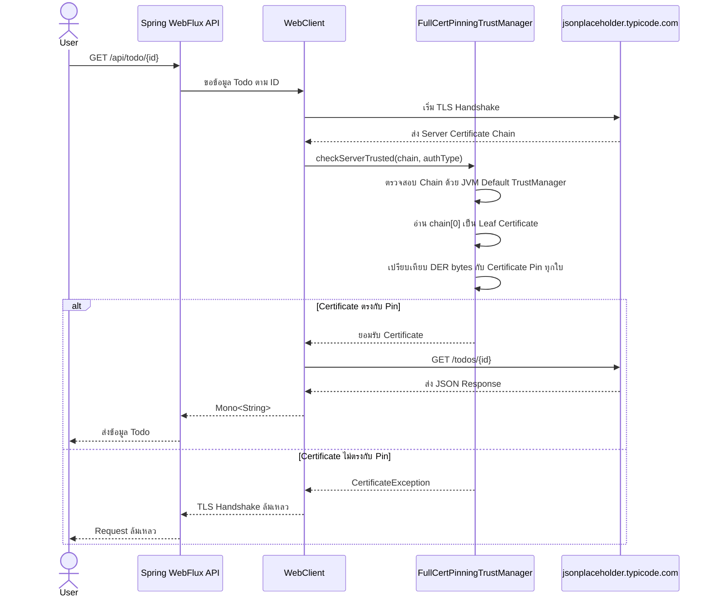

# Spring WebFlux Full Certificate Pinning

โปรเจกต์ Proof of Concept (PoC) สำหรับสาธิตการทำ **Full Certificate Pinning** ด้วย Spring Boot WebFlux, Reactor Netty `HttpClient` และ `WebClient`

แอปพลิเคชันจะเรียก JSONPlaceholder API ผ่าน HTTPS โดยก่อนอนุญาตให้ส่ง HTTP Request ระบบจะตรวจสอบตามลำดับดังนี้

1. ตรวจสอบความน่าเชื่อถือของ Certificate Chain ตามกลไกปกติของ JVM
2. อ่าน Leaf Certificate ที่ Server ส่งมา
3. เปรียบเทียบ Certificate ทั้งใบในรูปแบบ DER กับ Certificate Pin ทุกใบที่ตั้งค่าไว้
4. อนุญาตให้เชื่อมต่อเมื่อ Certificate ตรงกับ Pin อย่างน้อยหนึ่งใบ

> โปรเจกต์นี้ทำ **Full Leaf Certificate Pinning** ไม่ใช่ Certificate Fingerprint Pinning, Public Key Pinning หรือ Mutual TLS

---

## สิ่งที่โปรเจกต์นี้สาธิต

- การตั้งค่า Spring WebFlux `WebClient` ร่วมกับ Reactor Netty SSL Context
- การสร้าง Custom `X509TrustManager`
- การตรวจสอบ Certificate Chain ตามปกติก่อนตรวจสอบ Certificate Pin
- การเปรียบเทียบ Certificate ทั้งใบด้วย DER-encoded bytes
- การรองรับ Certificate Pin หลายใบ
- การโหลดไฟล์ Certificate นามสกุล `.pem` และ `.crt` จาก Classpath
- การปฏิเสธ TLS Connection เมื่อ Certificate ของ Server ไม่ตรงกับ Pin ที่กำหนดไว้

---

## หลักการทำงานสำคัญ

การตรวจสอบในโปรเจกต์นี้แบ่งออกเป็น 2 ขั้นตอน

```text
Server Certificate Chain
        |
        v
JVM Default Trust Validation
        |
        | ผ่าน
        v
Full Leaf Certificate Pin Validation
        |
        +-- ตรงกับ Pin อย่างน้อยหนึ่งใบ --> อนุญาตให้เชื่อมต่อ
        |
        +-- ไม่ตรงกับ Pin ทุกใบ ----------> ปฏิเสธ TLS Handshake
```

Certificate ของ Server ต้องผ่านทั้งสองเงื่อนไข

- Certificate Chain ต้องได้รับความเชื่อถือจาก JVM Default Trust Store
- Leaf Certificate ต้องตรงกับ Certificate Pin อย่างน้อยหนึ่งใบ

ไฟล์ Certificate ภายใน `src/main/resources/certs` ถูกใช้เป็น **Certificate Pin** ไม่ได้ถูกใช้เป็น Trust Anchor

---

## Request Flow



---

## Technology Stack

- Java 17
- Spring Boot 4.0.7
- Spring WebFlux
- Reactor Netty
- Maven Wrapper
- Lombok

---

## โครงสร้างโปรเจกต์

```text
spring-webflux-certificate-full-pinning
├── src
│   ├── main
│   │   ├── java/com/tirmizee
│   │   │   ├── client
│   │   │   │   └── MockJsonClient.java
│   │   │   ├── config
│   │   │   │   └── WebClientConfig.java
│   │   │   ├── controller
│   │   │   │   └── TestController.java
│   │   │   ├── security
│   │   │   │   ├── CertificatePinLoader.java
│   │   │   │   └── FullCertPinningTrustManager.java
│   │   │   └── SpringWebfluxCertificateFullPinningApplication.java
│   │   └── resources
│   │       ├── certs
│   │       │   ├── typicode-current.pem
│   │       │   ├── typicode-backup.pem
│   │       │   └── typicode-future.pem
│   │       └── application.yaml
│   └── test
├── pom.xml
├── mvnw
└── mvnw.cmd
```

---

## องค์ประกอบหลัก

### `CertificatePinLoader`

ทำหน้าที่โหลดไฟล์ Certificate นามสกุล `.crt` และ `.pem` ทั้งหมดจากตำแหน่งต่อไปนี้

```text
classpath:certs/
```

Certificate แต่ละใบจะถูกอ่านเป็น X.509 Certificate จากนั้นแปลงเป็น DER-encoded bytes และเพิ่มเข้าไปในชุด Certificate Pin

แนวทางนี้ช่วยให้รองรับ Certificate Pin หลายใบได้โดยไม่ต้องเขียนค่า Certificate ไว้ใน Java Code โดยตรง

### `FullCertPinningTrustManager`

คลาสนี้ Implement `X509TrustManager` และตรวจสอบ Certificate ตามลำดับดังนี้

1. ส่งต่อการตรวจสอบ Certificate Chain ให้ JVM Default `X509TrustManager`
2. อ่าน `chain[0]` ซึ่งเป็น Leaf Certificate ของ Server
3. เรียก `X509Certificate#getEncoded()` เพื่ออ่าน Certificate ทั้งใบในรูปแบบ DER
4. เปรียบเทียบ Certificate กับ Pin ทุกใบด้วย `MessageDigest.isEqual`
5. Throw `CertificateException` เมื่อ Certificate ไม่ตรงกับ Pin ทุกใบ

เนื่องจากระบบเปรียบเทียบ Certificate ทั้งใบ Certificate ที่ออกใหม่จะไม่ตรงกับ Pin เดิม แม้ว่าจะใช้ข้อมูลบางส่วนเหมือนเดิม เช่น

- Domain เดิม
- Issuer เดิม
- Subject เดิม
- Public Key เดิม

หากข้อมูลใดข้อมูลหนึ่งภายใน Certificate เปลี่ยนแปลง DER-encoded bytes ของ Certificate ก็จะเปลี่ยนตามไปด้วย

### `WebClientConfig`

ทำหน้าที่สร้าง Reactor Netty `SslContext` ที่ใช้ Custom Trust Manager และนำไปกำหนดให้ Spring WebFlux `WebClient`

### `MockJsonClient`

เรียก External API ต่อไปนี้

```text
https://jsonplaceholder.typicode.com/todos/{id}
```

### `TestController`

เปิด Local Endpoint สำหรับทดสอบ

```http
GET /api/todo/{id}
```

---

## สิ่งที่ต้องติดตั้ง

ตรวจสอบว่าเครื่องมี Java และ OpenSSL

```bash
java -version
openssl version
```

Java Version ที่ต้องการ

```text
Java 17 หรือใหม่กว่า
```

โปรเจกต์มี Maven Wrapper อยู่แล้ว จึงไม่จำเป็นต้องติดตั้ง Maven แยกต่างหาก

---

## วิธีเริ่มต้นใช้งาน

### 1. Clone Repository

```bash
git clone https://github.com/tirmizee/spring-webflux-certificate-full-pinning.git
cd spring-webflux-certificate-full-pinning
```

### 2. Run Application

สำหรับ macOS หรือ Linux

```bash
./mvnw spring-boot:run
```

สำหรับ Windows

```powershell
mvnw.cmd spring-boot:run
```

แอปพลิเคชันจะทำงานบน Default Port

```text
http://localhost:8080
```

### 3. เรียก Test Endpoint

```bash
curl http://localhost:8080/api/todo/1
```

ตัวอย่าง Response

```json
{
  "userId": 1,
  "id": 1,
  "title": "delectus aut autem",
  "completed": false
}
```

เมื่อ Certificate ของ Server ตรงกับ Pin ที่กำหนดไว้ จะพบ Log ในลักษณะต่อไปนี้

```text
[TLS Pinning] Inspecting server certificate: CN=typicode.com
[TLS Pinning Matched] Connection allowed.
```

---

## วิธีดึง Leaf Certificate จาก Server

ควรระบุ SNI ด้วย `-servername` เพื่อให้ Server ส่ง Certificate ของ Hostname ที่ถูกต้อง

```bash
openssl s_client \
  -connect jsonplaceholder.typicode.com:443 \
  -servername jsonplaceholder.typicode.com \
  </dev/null 2>/dev/null \
  | openssl x509 -outform PEM \
  > src/main/resources/certs/typicode-current.pem
```


ค่า SHA-256 Fingerprint มีประโยชน์สำหรับตรวจสอบ Certificate แต่โปรเจกต์นี้ไม่ได้เปรียบเทียบ Fingerprint

โปรเจกต์จะเปรียบเทียบ Certificate ทั้งใบในรูปแบบ DER

---

## การรองรับ Multiple Pins

ไฟล์ `.pem` และ `.crt` ทั้งหมดภายใน Directory ต่อไปนี้จะถูกโหลดอัตโนมัติ

```text
src/main/resources/certs/
```

ตัวอย่าง

```text
certs/
├── typicode-current.pem
├── typicode-future.pem
└── typicode-backup.pem
```

TLS Connection จะได้รับอนุญาตเมื่อ Leaf Certificate ของ Server ตรงกับ Certificate Pin **อย่างน้อยหนึ่งใบ**


